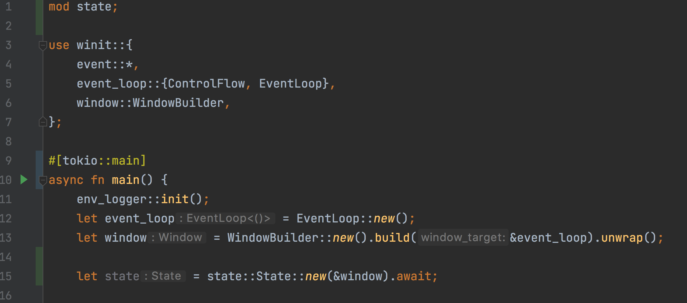

# Разработка графики на языке rust

Я решил разобраться в теме рендеринга 3D сцен, поэтому решил записать цикл уроков по этой теме.
Во многом это будет перевод официального [туториала](https://sotrh.github.io/learn-wgpu/#what-is-wgpu) по _wgpu_ + мои комментарии.

### Мотивация
Почему именно _wgpu_, а не _OpenGL_, _Vulkan_ или _DirectX_? Я за кроссплатформенную разработку, а wgpu поддерживает несколько графический backend-ов, операционных систем и даже компилируется в _webgl_ (то-есть, мы можем сделать игру в браузере).
Кроме того, стандарт _WebGPU_ (на чем основан _wgpu_) мне видится многообещающим, за ним будущее.

### Что такое WGPU?

[Wgpu](https://github.com/gfx-rs/wgpu) это реализация спецификации _WebGPU_ на языке _rust_, целью которой является предоставить более безопасный и удобный доступ к функционалу видео карты из браузера (замена _webgl_).
Во многом, API перекликается с таковым у Vulkan API, предоставляя также возможность _трансляции_ в другие backend-ы (_DirectX_, _Metal_, _Vulkan_).

## Приступим!

Как правило, любая игра начинается с окна, именно в нем в дальнейшем можно отрисовывать результаты работы видеокарты.

Сделайте новый проект с помощью _cargo_:
```
cargo new rust_wgpu_tutorial --bin
```

Я буду использовать следующие зависимости:
```toml
[dependencies]
winit = "0.26"
env_logger = "0.9"
log = "0.4"
wgpu = "0.13"
```

Теперь сам код:
```rust
use winit::{
    event::*,
    event_loop::{ControlFlow, EventLoop},
    window::WindowBuilder,
};

fn main() {
    env_logger::init();
    let event_loop = EventLoop::new();
    let window = WindowBuilder::new().build(&event_loop).unwrap();

    event_loop.run(move |event, _, control_flow| match event {
        Event::WindowEvent {
            ref event,
            window_id,
        } if window_id == window.id() => match event {
            WindowEvent::CloseRequested | WindowEvent::KeyboardInput {
                input:
                KeyboardInput {
                    state: ElementState::Pressed,
                    virtual_keycode: Some(VirtualKeyCode::Escape),
                    ..
                },
                ..
            } => *control_flow = ControlFlow::Exit,
            _ => {}
        },
        _ => {}
    });
}
```

Помимо самого окна я добавил еще логгер, чтобы в дальнейшем видеть детализацию ошибок _wgpu_, если они произойдут.
Если вы работали с растом, то этот код не вызывает много вопросов, кроме разве что конструкции внутри `match`.
Там говорится следующее: для всех событий в `event_loop`, отбери только те, которые относятся к текущему окну. 
Если событие `WindowEvent::CloseRequested`, либо `WindowEvent::KeyboardInput`, тогда происходит деструктуризация структуры `KeyboardInput`. 
Если поле `virtual_keycode` внутри равно `Some(VirtualKeyCode::Escape)`, тогда установи событие `ControlFlow::Exit` (закрой окно).
Напоминает продвинутый pattern-matching в _haskell_. Вот за что я люблю _rust_.

Отлично, окно отображается! Сделаем небольшой рефакторинг, добавив файл `state.rs` в папку `src`, со следующим содержимым:

```rust
use winit::window::Window;
use winit::{
    event::*,
};

pub struct State {
    surface: wgpu::Surface,
    device: wgpu::Device,
    queue: wgpu::Queue,
    config: wgpu::SurfaceConfiguration,
    size: winit::dpi::PhysicalSize<u32>,
}

impl State {
    async fn new(window: &Window) -> Self {
        todo!()
    }

    fn resize(&mut self, new_size: winit::dpi::PhysicalSize<u32>) {
        todo!()
    }

    fn input(&mut self, event: &WindowEvent) -> bool {
        todo!()
    }

    fn update(&mut self) {
        todo!()
    }

    fn render(&mut self) -> Result<(), wgpu::SurfaceError> {
        todo!()
    }
}
```

Начнем с метода `new`:
```rust
async fn new(window: &Window) -> Self {
    let size = window.inner_size();

    // instance - объект для работы с wgpu
    // Backends::all => OpenGL + Vulkan + Metal + DX12 + Browser WebGPU
    let instance = wgpu::Instance::new(wgpu::Backends::all());
    let surface = unsafe { instance.create_surface(window) };
    let adapter = instance.request_adapter(
        &wgpu::RequestAdapterOptions {
            power_preference: wgpu::PowerPreference::LowPower,
            compatible_surface: Some(&surface),
            force_fallback_adapter: false,
        },
    ).await.unwrap();
}
```

### Instance и Adapter

Для работы с видеокартой нам понадобиться `Adapter` и `Surface`, которые можно создать через методы `instance`.
Мне нравится, что прежде чем работать с видеокартой, нужно создать `instance`, а не работать с глобальным изменяемым состоянием, как это делается в _OpenGL_, например.

При выборе адаптера, мы руководствуемся следующими опциями:
- `power_preference` в этом свойстве можно задать приоритет выбора _GPU_. При выборе `LowPower`, _wgpu_ выберет интегрированную видеокарту.
- `compatible_surface` проверяем совместимость адаптера с созданным окном.
- `force_fallback_adapter` если этот флаг установлен в `true`, _wgpu_ выберет адаптер, который с больше долей вероятности будет работать на любом железе, предпочтение будет отдано интегрированной карте.


### Surface

`Surface` это область окна (как _canvas_ в _html_), которая будет использоваться для отрисовки.
Чтобы получить `surface`, окно должно реализовать `HasRawWindowHandle` из пакета [raw-window-handle](https://crates.io/crates/raw-window-handle).
В нашем случае, `winit` подходит под эти требования.

### Device & Queue

Как и в случае с `instance`, мы работаем не с глобальными объектами, а сами создаем нужные структуры.
Чтобы создать `device` и `queue`, я добавил следующим код:
```rust
let (device, queue) = adapter.request_device(
    &wgpu::DeviceDescriptor {
        features: wgpu::Features::empty(),
        limits: wgpu::Limits::default(),
        label: None,
    },
    None, // Trace path
).await.unwrap();
```
Мы можем указать конкретные возможности видеокарты, которые хотим использовать в свойстве `features`.
Чтобы задать пороговые значения для свойств, используется поле `limits`. Например, там есть свойства `max_vertex_attributes` или `max_vertex_buffer_array_stride`.
Посмотреть список всех свойств можно [здесь](https://docs.rs/wgpu/latest/wgpu/struct.Limits.html).

Указание этих свойств может быть полезно, чтобы расширить спектр поддерживаемых GPU.
#
Последнее, что нужно добавить в метод `State::new`, это создание конфига:
```rust
let config = wgpu::SurfaceConfiguration {
    usage: wgpu::TextureUsages::RENDER_ATTACHMENT,
    format: surface.get_supported_formats(&adapter)[0],
    width: size.width,
    height: size.height,
    present_mode: wgpu::PresentMode::Fifo,
};
surface.configure(&device, &config);
// Формируем структуру State
Self {
    surface,
    device,
    queue,
    config,
    size
}
```

Посмотрим подробнее на поля конфига:
- `usage` показывает, в каком режиме должна работать видеокарта.
- `format` определяет, в каком формате будут храниться текстуры `SurfaceTextures`. У разных дисплеев могут быть свои требования, поэтому здесь выбирается первый подходящий формат.
- `present_mode` определяет, как будет синхронизироваться `Surface` с экраном. `wgpu::PresentMode::Fifo` означает `VSYNC`. 

#

Осталось создать структуру `State` в методе `main`:


Тк метод `State::new` асинхронный, вызвать его мало, нужно еще дождаться его выполнения, для чего используется `.await`.
Чтобы этот код работал, нужен `Executor`. Я воспользуюсь `tokio`, указав его в зависимостях: `tokio = { version = "1", features = ["full"] }`.  
Метод `main` тоже нужно сделать асинхронным и пометить аннотацией `#[tokio::main]`.


Теперь все работает!
