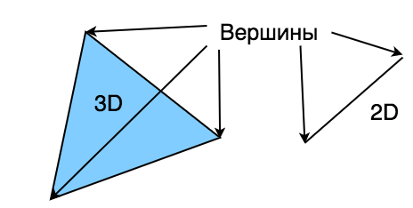
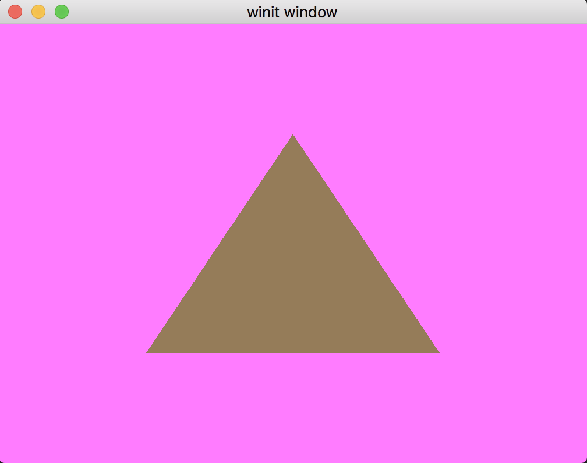

# The Pipeline. Графический конвейер

Если вы работали с _OpenGL_, то наверняка знаете про шейдеры.
Конвейер объединяет все операции, которые видеокарта будет делать с входными данными (в том числе и шейдеры) в одном месте.

Шейдер - это мини программы, которые выполняются на видеокарте. Выделяют три типа шейдеров: вершинный, фрагментный и вычислительный.
Есть и геометрические шейдеры, но их мы не будем рассматривать в этом уроке. 



Vertex (вершина) — это точка в 3D пространстве (или 2D).
Вершины объединяются в группы по 3 или 2, формируя треугольники или отрезки.
С помощью треугольников можно сделать модель любой сложности, начиная от куба и заканчивая человеком.

Вершинный шейдер используется для управления вершинами, например сдвиг или масштабирование.

Затем вершины преобразуются во _фрагменты_.
Каждый пиксель в итоговом изображении имеет _фрагмент_, для управления цветом.

## WGSL

Существует несколько языков для написания шейдеров: GLSL, HLSL, MSL, SPIR-V, которые используются соответственно в _OpenGL_, _DirectX_, _Metal_, _Vulkan_.
Но в стандарте _WebGPU_ определили новый язык ~~чтобы управлять ими всеми~~ для унификации. _WGSL_ можно конвертировать во все описанные языки шейдеров.

Напишем наш первый шейдер!

```wgsl
// Вершинный шейдер

struct VertexOutput {
    @builtin(position) clip_position: vec4<f32>,            // 1
};

@vertex                                                     // 2
fn vs_main(
    @builtin(vertex_index) in_vertex_index: u32,            // 3
) -> VertexOutput {
    var out: VertexOutput;                                  // 4
    let x = f32(1 - i32(in_vertex_index)) * 0.5;            // 5
    let y = f32(i32(in_vertex_index & 1u) * 2 - 1) * 0.5;
    out.clip_position = vec4<f32>(x, y, 0.0, 1.0);          // 6
    return out;             
}
```
Довольно сильно напоминает rust, ненаходите?

1. Структура `VertexOutput` определяет выходное значение шейдера.
Пока что в нем будет только одно поле `clip_position`, помеченное аннотацией `@builtin(position)`.
Тк шейдер имеет входные и выходные параметры (результат вычисления), мы должны указать явным образом, какое именно поле в структуре `VertexOutput` представляет итоговые координаты (position), с помощью аннотации.
В _OpenGL_ для этого используется `gl_Position`.

2. Точка входа в программу шейдеров _WGSL_ помечена аннотацией `@vertex`.
В _WGSL_ вершинный и фрагментный шейдер могут находиться в одном файле, что является несомненным плюсом.

3. На входе в функцию задается один параметр `in_vertex_index`, который задается в конфигурации `pipeline`.
Аннотация `@builtin(vertex_index)` задает назначение аргумента.
Это демонстрационный пример, далее будет использоваться другая аннотация.
В реальных шейдерах чаще задаются непосредственно вершины, но в данном примере мы будем их вычислять динамически, опираясь только на `in_vertex_index`.

4. Внутри мы видим объявление переменной с типом `VertexOutput`, которая будет возвращаться из функции.

5. При вычислении координат `x` и `y` используются функции `f32` & `i32`, они выполняют роль приведения (cast) типов.
Так же, как и в расте, в _WGSL_ есть изменяемый `var` переменные и не изменяемые `let`.

6. Присваивание полей структуры делается аналогичны, задаем значение `out.clip_position` и возвращаем `out`.

В данном примере мы можем задать выходное значение напрямую, без структуры `VertexOutput`:
```wgsl
@vertex
fn vs_main(
    @builtin(vertex_index) in_vertex_index: u32
) -> @builtin(position) vec4<f32> {
    // ...
}
```
Пока что я оставлю эту структуру, тк позже добавлю туда еще полей.

### Фрагметный шейдер

```wgsl
@fragment
fn fs_main(in: VertexOutput) -> @location(0) vec4<f32> {
    return vec4<f32>(0.3, 0.2, 0.1, 1.0);
}
```
Здесь мы задаем выходной цвет заливки пространства внутри вершин (треугольников) в коричневый. По аналогии с `VertexOutput`, `@location(0)` задает индекс выходного фрагментного буфера, только там использовалось именованное поле `position`, а здесь используются числовые индексы.
Позже добавим структуру.

## Новый State

Настало время обновить структуру `State`!  
Добавим `pipeline`:
```rust
pub struct State {
    surface: wgpu::Surface,
    device: wgpu::Device,
    queue: wgpu::Queue,
    mouse_x: Option<f64>,
    mouse_y: Option<f64>,
    config: wgpu::SurfaceConfiguration,
    pub(crate) size: winit::dpi::PhysicalSize<u32>,
    // NEW!
    render_pipeline: wgpu::RenderPipeline,
}
```

#

Перейдем к методу `State::new`:
```rust
let shader = device.create_shader_module(wgpu::include_wgsl!("shader.wgsl"));
```
Макрос `include_wgsl!` читает указанный файл и преобразует его в `ShaderModuleDescriptor`.

Создадим `render_layout`:
```rust
let render_pipeline_layout =
    device.create_pipeline_layout(&wgpu::PipelineLayoutDescriptor {
        label: Some("Render Pipeline Layout"),
        bind_group_layouts: &[],
        push_constant_ranges: &[],
    });
```
Пока что здесь ничего интересного, позже мы подробнее рассмотрим, что может быть внутри `bind_group_layouts`.

#

```rust
let render_pipeline = device.create_render_pipeline(&wgpu::RenderPipelineDescriptor {
    label: Some("Render Pipeline"),
    layout: Some(&render_pipeline_layout),
    vertex: wgpu::VertexState {                      // 1
        module: &shader,
        entry_point: "vs_main",                      // 2.
        buffers: &[],                                // 3.
    },
    fragment: Some(wgpu::FragmentState {             // 4.
        module: &shader,
        entry_point: "fs_main",                      // 5
        targets: &[Some(wgpu::ColorTargetState {     // 6.
            format: config.format,
            blend: Some(wgpu::BlendState::REPLACE),
            write_mask: wgpu::ColorWrites::ALL,
        })],
    }),
    // ...
```

Ранее я говорил, что _WGSL_ умеет хранить разные типы шейдеров в одном файле.
Именно здесь задаются точки входа для вершинного и фрагментных шейдеров.
Рассмотрим, что еще здесь происходит:
1. Структура вершинного шейдера
2. Точка входа вершинного шейдера
3. Буфер, который будет отправлен на обработку в вершинный шейдер. Обычно, здесь находяться вершины, но в данном примере вершины вычисляются прямо в шейдере (`x` и `y`), поэтому здесь буфер пустой.
4. Структура фрагментного шейдера
5. Точка входа фрагментного шейдера
6. `ColorTargetState` указывает, какой цветовой буфер использовать. Сейчас мы берем значение из `surface`. `ColorWrites::ALL` говорит использовать все цвета: красный, синий, зеленый и альфа канал. `BlendState::REPLACE` задает поведение при смешевании, мы указываем, что новый цвет должен перезаписать старый.

#

```rust
    // ...
    primitive: wgpu::PrimitiveState {
        topology: wgpu::PrimitiveTopology::TriangleList, // 1.
        strip_index_format: None,
        front_face: wgpu::FrontFace::Ccw,                // 2.
        cull_mode: Some(wgpu::Face::Back),
        polygon_mode: wgpu::PolygonMode::Fill,
        unclipped_depth: false,
        conservative: false,
    },
    // ...
```

Здесь мы задаем как преобразовывать входной буфер из вершин в треугольники.
1. `PrimitiveTopology::TriangleList` каждые три вершины идущие подряд формируют треугольник
2. `front_face` и `cull_mode` определяет, какие треугольники будут считаться находящимися на переднем плане в пространстве. `FrontFace::Ccw` говорит, что треугольник находится на переднем плане, если его вершины определены в направлении против часовой стрелки. Треугольники, которых нет на переднем плане не будут отображаться на итоговой картинке. Позже мы еще раз затронем процесс `culling-а`

#

```rust
    depth_stencil: None,                      // 1.
    multisample: wgpu::MultisampleState {
        count: 1,                             // 2.
        mask: !0,                             // 3.
        alpha_to_coverage_enabled: false,     // 4.
    },
    multiview: None, // 5.
});
```

1. Пока мы не будем использовать `depth_stencil`
2. Величина сглаживания
3. Определяет, какие выборки будут активны. Значение `!0` значит "все". Подроюнее про сглаживания читайте [здесь](https://ru.wikipedia.org/wiki/%D0%9C%D0%BD%D0%BE%D0%B6%D0%B5%D1%81%D1%82%D0%B2%D0%B5%D0%BD%D0%BD%D0%B0%D1%8F_%D0%B2%D1%8B%D0%B1%D0%BE%D1%80%D0%BA%D0%B0_%D1%81%D0%B3%D0%BB%D0%B0%D0%B6%D0%B8%D0%B2%D0%B0%D0%BD%D0%B8%D1%8F)
4. Пока что не будем это использовать
5. Это свойство используется для рендеринга в массивы текстур, не наш случай 

#

```rust
Self {
    surface,
    device,
    queue,
    config,
    size,
    // NEW!
    render_pipeline,
}
```
Теперь у нас есть пайплайн!

## Render
Если сейчас запустить программу, ничего не измениться, потому что рендеринг остался старый и в нем не используется новый пайплайн.
Сейчас мы это исправим!

Добавьте следующий код в метод `State::render`:
```rust
// ...
{
    // 1.
    let mut render_pass = encoder.begin_render_pass(&wgpu::RenderPassDescriptor {
        label: Some("Render Pass"),
        color_attachments: &[
            Some(wgpu::RenderPassColorAttachment {
                view: &view,
                resolve_target: None,
                ops: wgpu::Operations {
                    load: wgpu::LoadOp::Clear(
                        wgpu::Color {
                            r: self.mouse_y.unwrap_or(0.1),
                            g: 0.2,
                            b: self.mouse_x.unwrap_or(0.3),
                            a: 1.0,
                        }
                    ),
                    store: true,
                }
            })
        ],
        depth_stencil_attachment: None,
    });

    // NEW!
    render_pass.set_pipeline(&self.render_pipeline);    // 2.
    render_pass.draw(0..3, 0..1);                       // 3.
}
```

1. Сохраним результат вызова `begin_render_pass` в `render_pass`
2. Связываем `render_pass` и `render_pipeline`
3. Вызываем отрисовку

Обратите внимание, я обрамил код в еще одни фигурные скобки.
Это нужно, чтобы обойти ограничение на наличие двух изменяемых ссылок в одной области видимости.
Без них код не скомпилируется.

Должен получиться такой треугольник:


## Домашнее задание

Добавьте второй пайплайн, который будет вычислять цвет во фрагментном шейдере исходя из позиции в вершинном шейдере (`VertexOutput`).
Сделайте переключение между пайплайнами по нажатии на кнопку space.

[Ссылка на оригинал](https://sotrh.github.io/learn-wgpu/beginner/tutorial3-pipeline/#what-s-a-pipeline)