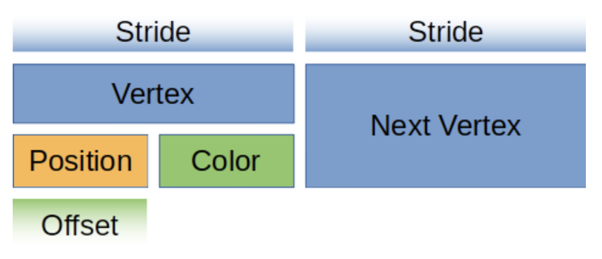
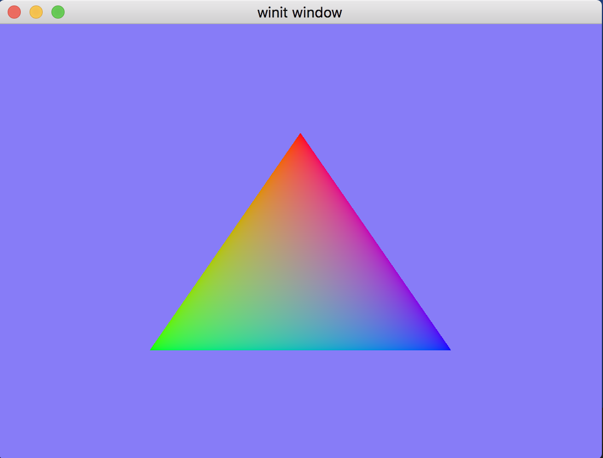
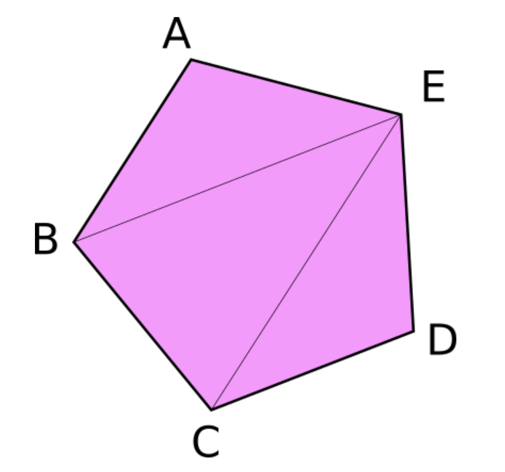

# Загрузка вершин в GPU

В этом уроке мы будем работать с вершинным и индексным буфером.

### Что такое буфер?

Под буфером имеется в виду любой **последовательный** массив данных, как например тип _Vec_ в расте.
Обычно в буфере храниться массив простых структур, но также там могут быть и сложные структуры данных (граф, например), при условии, что они будут иметь плоскую (последовательную) структуру.
Мы будем часто использовать буферы. Начнем изучение с вершинного и индексного буфера. 

## Вершинный буфер

В прошлом уроке мы динамически вычисляли вершины прямо в шейдере, поэтому обошлись без вершинного буфера.
Но это не лучшая практика, тк теряется возможность переиспользования шейдера и установки других вершин без перезапуска программы.
Сейчас мы перепишем код, чтобы вершинный буфер формировался на стороне программы и потом отправим его в шейдер.

Прежде всего, нужно объявить структуру в файле `state`, которая будет описывать вершины:
```rust
#[repr(C)]
#[derive(Copy, Clone, Debug, bytemuck::Pod, bytemuck::Zeroable)]
struct Vertex {
    position: [f32; 3],
    color: [f32; 3],
}
```
Эта структура описывать вершину в трехмерных координатах, ее положение (x, y, z) и цвет (red, green, blue).
Обратите внимание на аннотацию `#[repr(C)]`, она говорит компилятору использовать правила выравнивания из языка С.
Если ее убрать, будет достаточно трудно найти ошибку. Как правило, все структуры, которые будут отправляться в _GPU_, должны быть помечены `#[repr(C)]`.

Еще я добавил `bytemuck` в `Cargo.toml`:
```toml
bytemuck = { version = "1.4", features = ["derive"] }
```

Теперь можно сделать сами вершины:
```rust
const VERTICES: &[Vertex] = &[
    Vertex { position: [0.0, 0.5, 0.0], color: [1.0, 0.0, 0.0] },
    Vertex { position: [-0.5, -0.5, 0.0], color: [0.0, 1.0, 0.0] },
    Vertex { position: [0.5, -0.5, 0.0], color: [0.0, 0.0, 1.0] },
];
```
Вершины здесь указаны против часовой стрелки: верхний угол, нижний левый и правый левый.
В прошлом уроке мы указывали, что вершины должны располагаться в буфере именно в таком порядке, тогда они будут на переднем плане.

#

Указатель на буфер будет храниться в структуре `State`:
```rust
struct State {
    // ...
    render_pipeline: wgpu::RenderPipeline,

    // NEW!
    vertex_buffer: wgpu::Buffer,

    // ...
}
```

Создаем буфер:
```rust
let vertex_buffer = device.create_buffer_init(
    &wgpu::util::BufferInitDescriptor {
        label: Some("Vertex Buffer"),
        contents: bytemuck::cast_slice(VERTICES),
        usage: wgpu::BufferUsages::VERTEX,
    }
);
```
Чтобы у вас появился метод `create_buffer_init`, нужно импортировать трейт `use wgpu::util::DeviceExt`.
Для `contents` я использую приведение типа через `bytemuck`, именно для этого `Vertex` был помечен `bytemuck::Pod` & `bytemuck::Zeroable`.
Аннотация `Pod` это аббревиатура, которая расшифровывается "Plain Old Data", которая включает преобразование структуры в `&[u8]`.
`Zeroable` значит, что мы можем безопасно использовать `std::mem::zeroed()` на структуре.

#

И в конце добавляем:
```rust
Self {
    surface,
    device,
    queue,
    config,
    size,
    render_pipeline,
    // NEW!
    vertex_buffer,
}
```

## Отправка буфера в GPU

Я сделал буфер, но пока что он не используется в `render_pipeline`.
Чтобы его задействовать, нужно создать _разметку_ данных (`VertexBufferLayout`), потому что данные в буфере передаются в _GPU_ в сыром виде, без типизации.
То-есть, мы не сможем понять, где в буфере будут находиться `position`, а где `color`.

`VertexBufferLayout` определяет представление (layout) данных буфера в памяти:
```rust
impl Vertex {
    fn description<'a>() -> wgpu::VertexBufferLayout<'a> {
        wgpu::VertexBufferLayout {
            array_stride: std::mem::size_of::<Vertex>() as wgpu::BufferAddress,      // 1
            step_mode: wgpu::VertexStepMode::Vertex,                                 // 2
            attributes: &[                                                           // 3
                wgpu::VertexAttribute {
                    offset: 0,                                                       // 4
                    shader_location: 0,                                              // 5
                    format: wgpu::VertexFormat::Float32x3,                           // 6
                },
                wgpu::VertexAttribute {
                    offset: std::mem::size_of::<[f32; 3]>() as wgpu::BufferAddress,
                    shader_location: 1,
                    format: wgpu::VertexFormat::Float32x3,
                }
            ]
        }
    }
}
```
1. `array_stride` определяет размер структуры `Vertex` вместе с выравниванием. В нашем случае размер будет примерно 24 байта.
2. `step_mode` задает режим индексации. Помните входной аргумент в вершинном шейдере `@builtin(vertex_index) in_vertex_index: u32`? От заданного параметра `VertexStepMode` зависит, с какими индексами будет вызываться вершинный шейдер. `Vertex` режим работы по-умолчанию, кроме него есть еще `Instance`, мы рассмотрим, как с ним работать позже.
3. `attributes` нужен для описания полей структуры `Vertex`. В нашем случае структура имеет два поля: позицию и цвет. Соответственно, в `atrributes` мы имеем две записи для позиции и цвета.
4. `offset` задает смещение относительно `array_stride` для каждого поля в структуре `Vertex`. Первое поле — `position` имеет смещение 0 (тк перед ним ничего нет). Для вычисления смещения следующего поля, нужно прибавить к нулю размер `position`, то-есть `std::mem::sizeof::<[f32; 3]>()` или 4 * 3 = 12 байт.
5. `shader_location` задает индекс для `location`, через который можно будет обращаться к полю `position`, например так `@location(0) position: vec3<f32>`.
6. `format` задает тип параметра (поля) структуры. В данном случае, `positon` имеет тип `[f32; 3]`, ему соответсвует тип `vec3<f32>` в шейдере, а в поле `format` мы указываем `VertexFormat::Float32x3`.

Вот так это выглядит (взял картинку из оригинальной статьи):


#

Теперь мы можем задать описание нашего буфера в `render_pipeline`:
```rust
let render_pipeline = device.create_render_pipeline(&wgpu::RenderPipelineDescriptor {
    // ...
    vertex: wgpu::VertexState {
        // ...
        buffers: &[
            Vertex::description(),
        ],
    },
    // ...
});
```

И отправить буфер в `render_pass`:
```rust
render_pass.set_vertex_buffer(0, self.vertex_buffer.slice(..));
```
`set_vertex_buffer` принимает два аргумента, первый — это слот, в который попадет буфер, второй сам буфер. При необходимости, мы можем отправлять данные порционно, но в данном случае я отправляю весь буфер.

Мне нужно отрисовать сейчас три вершины, поэтому я вызываю
```rust
render_pass.draw(0..3, 0..1);
```
Но для большей гибкости, здесь лучше использовать переменную величину, которая будет соответствовать реальному размеру текущего буфера:
```rust
render_pass.draw(0..VERTICES.len() as u32, 0..1);
```

#

Если сейчас запустить программу, ничего не измениться, потому что нужно обновить шейдеры:
```wgsl
// Вершинный шейдер

struct VertexInput {
    @location(0) position: vec3<f32>,
    @location(1) color: vec3<f32>,
};

struct VertexOutput {
    @builtin(position) clip_position: vec4<f32>,
    @location(0) color: vec3<f32>,
};

@vertex
fn vs_main(
    model: VertexInput,
) -> VertexOutput {
    var out: VertexOutput;
    out.color = model.color;
    out.clip_position = vec4<f32>(model.position, 1.0);
    return out;
}

// Фрагментный шейдер

@fragment
fn fs_main(in: VertexOutput) -> @location(0) vec4<f32> {
    return vec4<f32>(in.color, 1.0);
}
```

Теперь готово:


## Индексный буфер

В них нет строгой необходимости, но они могут сократить количество используемое вершинным буфером памяти для больших моделей.
Рассмотрим такую фигуру (картинка из оригинальной статьи):


В ней 5 вершин и три треугольника. Вершинный буфер для нее будет выглядеть следующим образом:
```rust
const VERTICES: &[Vertex] = &[
    Vertex { position: [-0.0868241, 0.49240386, 0.0], color: [0.5, 0.0, 0.5] },     // A
    Vertex { position: [-0.49513406, 0.06958647, 0.0], color: [0.5, 0.0, 0.5] },    // B
    Vertex { position: [0.44147372, 0.2347359, 0.0], color: [0.5, 0.0, 0.5] },      // E

    Vertex { position: [-0.49513406, 0.06958647, 0.0], color: [0.5, 0.0, 0.5] },    // B
    Vertex { position: [-0.21918549, -0.44939706, 0.0], color: [0.5, 0.0, 0.5] },   // C
    Vertex { position: [0.44147372, 0.2347359, 0.0], color: [0.5, 0.0, 0.5] },      // E

    Vertex { position: [-0.21918549, -0.44939706, 0.0], color: [0.5, 0.0, 0.5] },   // C
    Vertex { position: [0.35966998, -0.3473291, 0.0], color: [0.5, 0.0, 0.5] },     // D
    Vertex { position: [0.44147372, 0.2347359, 0.0], color: [0.5, 0.0, 0.5] },      // E
];
```
Можно заметить, что вершины C и B повторяются дважды, а E трижды.
Если взять размер каждой вершины в 24 байта, то из 216 байт, 96 будут повторяться.
Было бы здорово, если мы могли бы перечислить каждую из вершин только один раз?

Здесь приходит на помощь индексный буфер!
```rust
const VERTICES: &[Vertex] = &[
    Vertex { position: [-0.0868241, 0.49240386, 0.0], color: [0.5, 0.0, 0.5] },     // A
    Vertex { position: [-0.49513406, 0.06958647, 0.0], color: [0.5, 0.0, 0.5] },    // B
    Vertex { position: [-0.21918549, -0.44939706, 0.0], color: [0.5, 0.0, 0.5] },   // C
    Vertex { position: [0.35966998, -0.3473291, 0.0], color: [0.5, 0.0, 0.5] },     // D
    Vertex { position: [0.44147372, 0.2347359, 0.0], color: [0.5, 0.0, 0.5] },      // E
];

const INDICES: &[u16] = &[
    0, 1, 4,    // треугольник A, B, E
    1, 2, 4,    // треугольник B, C, E
    2, 3, 4,    // треугольник C, D, E
];
```
В таком сценарии `VERTICES` будет занимать всего 120 байт, а `INDICES` 18 байт + 2 на выравнивание.
Мы сэкономили 76 байт! Это кажется мало, но для больших фигур разница будет больше.


[Ссылка](https://sotrh.github.io/learn-wgpu/beginner/tutorial4-buffer/#we-re-finally-talking-about-them) на оригинал