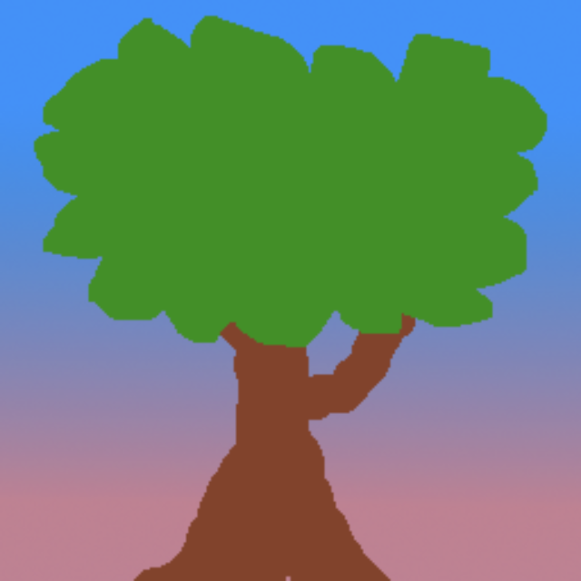
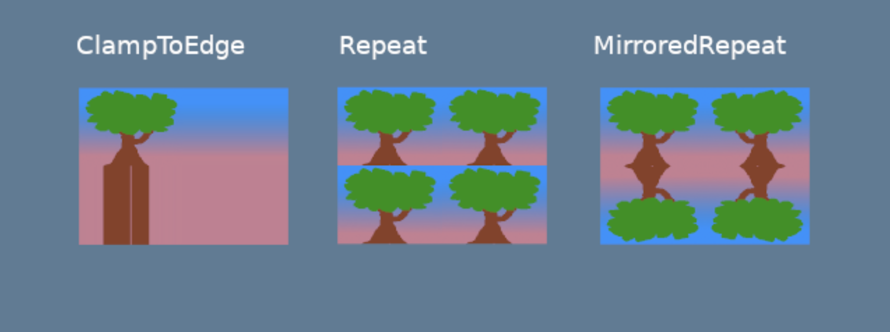
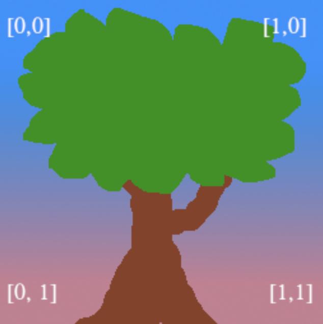
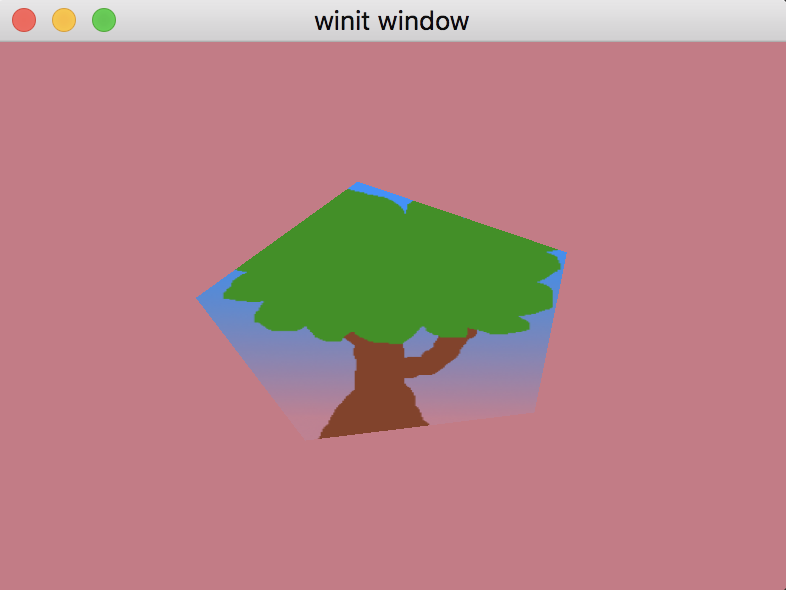

# Текстуры

Текстурами называют изображения, которые накладывают поверх сетки (фигуры) для того, чтобы придать ей фактуру и/или детализацию.

## Загрузка изображения

Первым делом, нам нужно добавить само изображение в папку с проектом.
Для этого, я сделал папку `assets` и положил туда картинку:


Для чтения файла я буду использовать `image` crate:
```toml
image = "0.24"
```

Далее, я сделаю отдельный модуль — `texture`:
```rust
use std::error::Error;

pub struct Texture {
    pub texture: wgpu::Texture,
    pub view: wgpu::TextureView,
    pub sampler: wgpu::Sampler,
}
```

Сделаем новый метод `Texture::from_image`:
```rust
pub fn from_image(
    device: &wgpu::Device,
    queue: &wgpu::Queue,
    img: &image::DynamicImage,
    label: Option<&str>
) -> Self {
    let diffuse_rgba = diffuse_image.to_rgba8();                            // 1
    
    use image::GenericImageView;
    let dimensions = diffuse_image.dimensions();
    
    let size = wgpu::Extent3d {                                             // 2
        width: dimensions.0,
        height: dimensions.1,
        // Мы будем работать в 2D пространстве, поэтому используем только один слой
        depth_or_array_layers: 1,
    };
    let texture = device.create_texture(                                    // 3
        &wgpu::TextureDescriptor {
            label,
            size,
            mip_level_count: 1,
            sample_count: 1,
            dimension: wgpu::TextureDimension::D2,
            // Указываем режим преобразования цвета из формата sRGB в линейное float [0, 1] значение
            format: wgpu::TextureFormat::Rgba8UnormSrgb,
            // TEXTURE_BINDING флаг устанавливается, если нужно использовать текстуру в шейдере
            // COPY_DST говорит, что позже мы будем копировать позже изображение в эту текстуру
            usage: wgpu::TextureUsages::TEXTURE_BINDING | wgpu::TextureUsages::COPY_DST,
        }
    );
...
```
1. Преобразуем изображение в массив rgba байтов
2. Задаем (эмулируем) размерность в 3D пространстве
3. Создаем тектуру

Сейчас текстура пустая и нужно скопировать туда изображение:
```rust
...
    // Копируем изображение в созданную выше текстуру
    queue.write_texture(
        // Задаем, куда копировать изображение
        wgpu::ImageCopyTexture {
            aspect: wgpu::TextureAspect::All,
            texture: &texture,
            mip_level: 0,
            origin: wgpu::Origin3d::ZERO,
        },
        // Массив rgba пикселей
        &rgba,
        // Схема расположения данных
        wgpu::ImageDataLayout {
            offset: 0,
            bytes_per_row: std::num::NonZeroU32::new(4 * dimensions.0),
            rows_per_image: std::num::NonZeroU32::new(dimensions.1),
        },
        size,
    );

    Self { texture, view, sampler }
}
```

### Фильтрация текстур

Эту часть я долго не знал, как перевести, потому что не имел дело с `Sampler`-ами.
Прежде чем разбираться со следующим фрагментом кода, дам небольшую вводную информацию.

Текстурные координаты не зависят от разрешения самой текстуры или экрана.
Это означает, что где-то есть механизм, отвечающий за сопоставление _текстурных пикселей_ (иногда их называют **тексели**) с текстурными координатами.
И `Sampler` как раз и является этим механизмом, у которого есть несколько режимов работы:

```rust
let view = texture.create_view(&wgpu::TextureViewDescriptor::default());
let sampler = device.create_sampler(
    &wgpu::SamplerDescriptor {
        address_mode_u: wgpu::AddressMode::ClampToEdge,     // 1
        address_mode_v: wgpu::AddressMode::ClampToEdge,
        address_mode_w: wgpu::AddressMode::ClampToEdge,
        mag_filter: wgpu::FilterMode::Linear,               // 2
        min_filter: wgpu::FilterMode::Nearest,              // 3
        mipmap_filter: wgpu::FilterMode::Nearest,
        ..Default::default()
    }
);
```
Рассмотрим режимы работы `Sampler` (_AddressMode_):
* `ClampToEdge` любой тексель, выходящий за пределы текстурных координат, примет цвет ближайшего к границе текстуры пикселя
* `Repeat` по-русски — замостить, текстура будет повторяться по всей площади фигуры
* `MirrorRepeat` похоже на `Repeat`, только изображение будет перевернуто, при выходе за границы текстуры



1. Мы можем задать разные режимы для каждой из координат `address_mode_*`
2. Какой фильтр использовать, когда нужно растянуть (magnify) текстуру
3. Какой фильтр использовать, когда нужно сжать (minify) текстуру

`FilterMode` предоставляет две опции:
* `Linear` смешивает цвет ближайших к текстурной координате текселей. Чем ближе тексель к заданой координате, тем больший вклад он внесет в итоговый цвет. Этот метод еще называют билинейной интерполяцией.
* `Nearest` берет цвет ближайшего к текстурной координате текселя. В этом режиме при близком рассмотрении можно увидеть угловатые узоры и пикселизацию.

Нам понадобится еще один вспомогательный метод, который будет читать изображение:
```rust
pub fn from_bytes(
    device: &wgpu::Device,
    queue: &wgpu::Queue,
    bytes: &[u8],
    label: &str
) -> anyhow::Result<Self> {
    let img = image::load_from_memory(bytes)?;
    Ok(Self::from_image(device, queue, &img, Some(label)))
}
```
Здесь я использовал `anyhow::Result` из [крейта](https://docs.rs/anyhow/latest/anyhow/) `anyhow = "1.0.64"`, для более удобной работы с ошибками.
###

Теперь можно создать текстуру в методе `State::new`:
```rust
surface.configure(&device, &config);

// Создаем текстуру
let diffuse_bytes = include_bytes!("../assets/tree.png");
let diffuse_texture = Texture::from_bytes(&device, &queue, diffuse_bytes, "tree.png").unwrap();
```
Мы создали текстуру, `view`, `sampler`, но они пока не выполняют никакой работы. Давайте объедению их вместе!

## BindGroup

`BindGroup` описывает набор ресурсов и схему данных для шейдеров. Мы объеденим ресурсы, сделанные выше.

Перед созданием `BindGroup`, нужно сделать `BindGroupLayout`:
```rust
...
let texture_bind_group_layout =
    device.create_bind_group_layout(&wgpu::BindGroupLayoutDescriptor {
        entries: &[
            wgpu::BindGroupLayoutEntry {
                binding: 0,                                 // 1
                visibility: wgpu::ShaderStages::FRAGMENT,
                ty: wgpu::BindingType::Texture {
                    multisampled: false,
                    view_dimension: wgpu::TextureViewDimension::D2,
                    sample_type: wgpu::TextureSampleType::Float { filterable: true },
                },
                count: None,
            },
            wgpu::BindGroupLayoutEntry {
                binding: 1,                                 // 2
                visibility: wgpu::ShaderStages::FRAGMENT,
                // Здесь указываем SamplerBindingType::Filtering, потому что выше в sample_type указано filterable: true
                ty: wgpu::BindingType::Sampler(wgpu::SamplerBindingType::Filtering),
                count: None,
            },
        ],
        label: Some("texture_bind_group_layout"),
    });
```
Эта схема данных содержит 2 связывания: первое для текстуры, второе для `Sampler`.
Они будут видны только во фрагментном (`ShaderStages::FRAGMENT`) шейдере.
Поле `visibility` принимает битовую маску из значений `NONE`, `VERTEX`, `FRAGMENT`, или `COMPUTE`.
Для текстур чаще всего используется `FRAGMENT`.

###

Теперь можно сделать `BindGroup`:
```rust
...
let diffuse_bind_group = device.create_bind_group(
    &wgpu::BindGroupDescriptor {
        layout: &texture_bind_group_layout,
        entries: &[
            wgpu::BindGroupEntry {
                binding: 0,
                resource: wgpu::BindingResource::TextureView(&diffuse_texture.view),    // 1
            },
            wgpu::BindGroupEntry {
                binding: 1,
                resource: wgpu::BindingResource::Sampler(&diffuse_texture.sampler),     // 2
            }
        ],
        label: Some("diffuse_bind_group"),
    }
);
```
Я использую `diffuse_texture.view` и `diffuse_texture.sampler`, сделанные выше.
`BindGroup` является частным случаем `BindGroupLayout`, поэтому между ними есть некоторое сходство.
В _WGPU_ их разделили для того, чтобы переключать их динамически (во время выполнения программы).
Для этого у них должна быть одна схема данных (BindGroupLayout). Позднее, мы будем хранить каждую текстуру в своем `BindGroup`.

Осталось добавить поля в структуру `State`:
```rust
struct State {
    surface: wgpu::Surface,
    device: wgpu::Device,
    queue: wgpu::Queue,
    config: wgpu::SurfaceConfiguration,
    size: winit::dpi::PhysicalSize<u32>,
    render_pipeline: wgpu::RenderPipeline,
    vertex_buffer: wgpu::Buffer,
    index_buffer: wgpu::Buffer,
    num_indices: u32,
    // NEW!
    diffuse_bind_group: wgpu::BindGroup,
    diffuse_texture: texture::Texture,
}
```

И вернуть `diffuse_bind_group` и `diffuse_texture`:
```rust
impl State {
    async fn new() -> Self {
        // ...
        Self {
            surface,
            device,
            queue,
            config,
            size,
            render_pipeline,
            vertex_buffer,
            index_buffer,
            num_indices,
            // NEW!
            diffuse_bind_group,
            diffuse_texture,
        }
    }
}
```
С методом `State::new` покончено!

Обновим рендеринг:
```rust
// render()
// ...
render_pass.set_pipeline(&self.render_pipeline);
render_pass.set_bind_group(0, &self.diffuse_bind_group, &[]); // NEW!
render_pass.set_vertex_buffer(0, self.vertex_buffer.slice(..));
render_pass.set_index_buffer(self.index_buffer.slice(..), wgpu::IndexFormat::Uint16);
```

## PipelineLayout

Помните `PipelineLayout`, который мы сделали во [втором](../../lesson2/docs/index.md) уроке?
В нем задаются все `BindGroupLayout`, которые будут использоваться в пайплайне.
```rust
async fn new(...) {
    // ...
    let render_pipeline_layout = device.create_pipeline_layout(
        &wgpu::PipelineLayoutDescriptor {
            label: Some("Render Pipeline Layout"),
            bind_group_layouts: &[&texture_bind_group_layout], // NEW!
            push_constant_ranges: &[],
        }
    );
    // ...
}
```
Теперь можно будет использовать `texture_bind_group_layout` в пайплайне!


## Новый вершинный буфер

Посмотрим на структуру `Vertex`:
```rust
#[repr(C)]
#[derive(Copy, Clone, Debug, bytemuck::Pod, bytemuck::Zeroable)]
struct Vertex {
    position: [f32; 3],
    color: [f32; 3],
}
```
Мы напрямую задавали цвет в вершинном буфере.  
Заменим поле `color` на `tex_coords`, тк теперь цвет будет вычисляться во фрагментном шейдере с помощью текстуры:
```rust
#[repr(C)]
#[derive(Copy, Clone, Debug, bytemuck::Pod, bytemuck::Zeroable)]
struct Vertex {
    position: [f32; 3],
    tex_coords: [f32; 2],
}
```

Тк текстурные координаты кодируются двумя значениями f32, нужно внести соответсвующие изменения и в `Vertex::description`:
```rust
...
wgpu::VertexAttribute {
    offset: std::mem::size_of::<[f32; 3]>() as wgpu::BufferAddress,
    shader_location: 1,
    format: wgpu::VertexFormat::Float32x2,      // было Float32x3
}
...
```

Теперь обновим сам вершинный буфер:
```rust
const VERTICES: &[Vertex] = &[
    Vertex { position: [-0.0868241, 0.49240386, 0.0], tex_coords: [0.4131759, 0.99240386], },     // A
    Vertex { position: [-0.49513406, 0.06958647, 0.0], tex_coords: [0.0048659444, 0.56958647], }, // B
    Vertex { position: [-0.21918549, -0.44939706, 0.0], tex_coords: [0.28081453, 0.05060294], },  // C
    Vertex { position: [0.35966998, -0.3473291, 0.0], tex_coords: [0.85967, 0.1526709], },        // D
    Vertex { position: [0.44147372, 0.2347359, 0.0], tex_coords: [0.9414737, 0.7347359], },       // E
];
```

## Шейдеры

Заключительный этап, перед тем, как мы увидим результат — текстуру на нашем пентагоне.
Мы изменили структуру `Vertex`, эти же изменения нужно отразить в вершинном шейдере:
```wgsl
// Вершинный шейдер

struct VertexInput {
    @location(0) position: vec3<f32>,
    @location(1) tex_coords: vec2<f32>,             // NEW!
};

struct VertexOutput {
    @builtin(position) clip_position: vec4<f32>,
    @location(0) tex_coords: vec2<f32>,             // NEW!
};

@vertex
fn vs_main(
    model: VertexInput,
) -> VertexOutput {
    var out: VertexOutput;
    out.tex_coords = vec2<f32>(model.tex_coords.x, 1.0 - model.tex_coords.y);   // NEW!
    out.clip_position = vec4<f32>(model.position, 1.0);
    return out;
}
```

Обратите внимание на строку `out.tex_coords = vec2<f32>(model.tex_coords.x, 1.0 - model.tex_coords.y)`.
В ней я инвертировал координату `y`, чтобы картинка не была перевернутая.
Это связано тем, что в _WGPU_ координата `y` направлена вверх, а в текстурах она направлена вниз.



###

Обновим фрагментный шейдер:
```wgsl
// Фрагментный шейдер

@group(0) @binding(0)
var t_diffuse: texture_2d<f32>;
@group(0) @binding(1)
var s_diffuse: sampler;

@fragment
fn fs_main(in: VertexOutput) -> @location(0) vec4<f32> {
    return textureSample(t_diffuse, s_diffuse, in.tex_coords);
}
```

Должно получиться вот так:



### Домашнее задание

Добавьте возможность менять текстуру по нажатию на кнопку space

[Ссылка на оригинал](https://sotrh.github.io/learn-wgpu/beginner/tutorial5-textures/#loading-an-image-from-a-file)