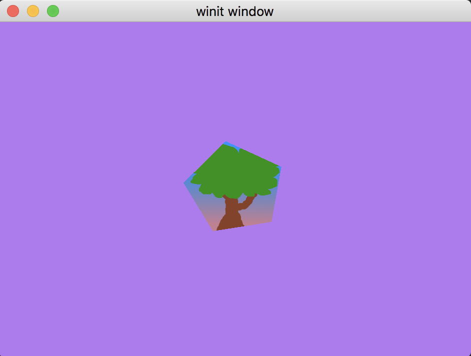
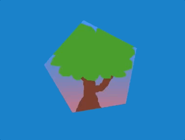
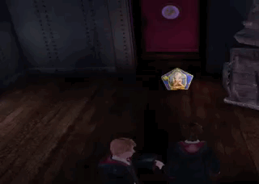

# Uniform буфер и 3D камера

Хотя до этого мы рисовали только двухмерные фигуры, на самом деле, мы работали в трехмерном пространстве. Именно поэтому структура `Vertex::position` имеет 3 координаты, а не 2. Но мы никак не можем увидеть трехмерное пространство. Чтобы это исправить, добавим камеру.

Создаем перспективу
Этот туториал больше про WGPU, поэтому здесь не будет в деталях рассматриваться математические аспекты работы с камерой, только практика. Если же вы хотите лучше разобраться в этой теме вам сюда и сюда. Мы будем использовать cgmath, который возьмет на себя всю работу с вычислениями. Добавьте его в зависимости проекта:
```toml
cgmath = "0.18.0"
```

Теперь можно сделать структуру для работы с камерой. Я сделаю отдельный файл `camera.rs`:
```rust
#[rustfmt::skip]
pub const OPENGL_TO_WGPU_MATRIX: cgmath::Matrix4<f32> = cgmath::Matrix4::new(
    1.0, 0.0, 0.0, 0.0,
    0.0, 1.0, 0.0, 0.0,
    0.0, 0.0, 0.5, 0.0,
    0.0, 0.0, 0.5, 1.0,
);

pub struct Camera {
    pub eye: cgmath::Point3<f32>,
    pub target: cgmath::Point3<f32>,
    pub up: cgmath::Vector3<f32>,
    pub aspect: f32,
    pub fovy: f32,
    pub znear: f32,
    pub zfar: f32,
}

impl Camera {
    pub fn build_view_projection_matrix(&self) -> cgmath::Matrix4<f32> {
        let view = cgmath::Matrix4::look_at_rh(self.eye, self.target, self.up);                     // 1
        let proj = cgmath::perspective(cgmath::Deg(self.fovy), self.aspect, self.znear, self.zfar); // 2
        return OPENGL_TO_WGPU_MATRIX * proj * view;                                                 // 3
    }
}
```
Самое интересное происходит в `build_view_projection_matrix`:
1. Матрица `view` перемещает мир в позицию камеры. Она будет преобразовывать мировые координаты в координаты пространства окна
2. Матрица `proj` создает эффект перспективы. Без нее близкие и далекие объекты были бы одного размера
3. В _WGPU_ используется координатная система DirectX & Metal. Это значит, что в нормализованных координатах (независимых от размера экрана) _WGPU_ оси `x` и `y` находятся в промежутке `[-1.0, +1.0]`, а ось `z` в `[0.0, +1.0]`. В то же время `cgmath` сделан для координатной системы _OpenGL_. Поэтому я использую матрицу `OPENGL_TO_WGPU_MATRIX` для трансляции координат.

Добавим теперь камеру в `State::new`:
```rust
struct State {
    // ...
    camera: Camera,
    // ...
}

async fn new(window: &Window) -> Self {
    // let diffuse_bind_group ...

    let camera = Camera {
        // координаты камеры
        eye: (0.0, 1.0, 4.0).into(),
        // смотрим на центр
        target: (0.0, 0.0, 0.0).into(),
        up: cgmath::Vector3::unit_y(),
        aspect: config.width as f32 / config.height as f32,
        fovy: 45.0,
        znear: 0.1,
        zfar: 100.0,
    };

    Self {
        // ...
        camera,
        // ...
    }
}
```
Теперь у нас есть камера и проекция, нужно каким-то образом отправить ее в шейдер.

### Uniform буфер
До этого момента мы использовали буферы для хранения вершинного, индексных массивов и даже текстур. Рассмотрим специальный буфер — uniform. Он отличаются тем, что доступен в любом месте в шейдерах (как глобальные переменные). На самом деле, мы уже использовали его для текстуры и sampler-а. Давайте сделаем еще один буфер для хранения матрицы проекции!

Добавим в файл `camera.rs` следующий код:
```rust
// Данные, которые будут отправляться в шейдер нужно пометить специальной аннотацией
#[repr(C)]
// Pod & Zeroable для удобного приведения типов перед отправкой в WGPU
#[derive(Debug, Copy, Clone, bytemuck::Pod, bytemuck::Zeroable)]
struct CameraUniform {
    // We can't use cgmath with bytemuck directly so we'll have
    // to convert the Matrix4 into a 4x4 f32 array
    view_proj: [[f32; 4]; 4],
}

impl CameraUniform {
    fn new() -> Self {
        use cgmath::SquareMatrix;
        Self {
            view_proj: cgmath::Matrix4::identity().into(),
        }
    }

    fn update_view_proj(&mut self, camera: &Camera) {
        self.view_proj = camera.build_view_projection_matrix().into();
    }
}
```

Теперь сделаем сам буфер в методе `State::new`:
```rust
// создание камеры

let mut camera_uniform = CameraUniform::new();
camera_uniform.update_view_proj(&camera);

let camera_buffer = device.create_buffer_init(
    &wgpu::util::BufferInitDescriptor {
        label: Some("Camera Buffer"),
        contents: bytemuck::cast_slice(&[camera_uniform]),
        usage: wgpu::BufferUsages::UNIFORM | wgpu::BufferUsages::COPY_DST,
    }
);
// ...
```

### Uniform буфер и BindGroup
Чтобы мы могли отправить буфер в видеокарту, нужно создать разметку (схему данных, layout):
```rust
// ...
let camera_bind_group_layout = device.create_bind_group_layout(&wgpu::BindGroupLayoutDescriptor {
    entries: &[
        wgpu::BindGroupLayoutEntry {
            binding: 0,
            visibility: wgpu::ShaderStages::VERTEX,     // 1
            ty: wgpu::BindingType::Buffer {
                ty: wgpu::BufferBindingType::Uniform,
                has_dynamic_offset: false,              // 2
                min_binding_size: None,
            },
            count: None,
        }
    ],
    label: Some("camera_bind_group_layout"),
});
// ...
```
1. Буфер камеры нужен только в вершинном шейдере
2. Поле `dynamic` обозначает, будет ли изменяться размер этого буфера. Это полезно, если вы храните массивы

После создания схемы данных, создадим `BindGroup` для буфера камеры:
```rust
// ...
let camera_bind_group = device.create_bind_group(&wgpu::BindGroupDescriptor {
    layout: &camera_bind_group_layout,
    entries: &[
        wgpu::BindGroupEntry {
            binding: 0,
            resource: camera_buffer.as_entire_binding(),
        }
    ],
    label: Some("camera_bind_group"),
});
// ...
```
Так же, как и с текстурой, нужно зарегистрировать схему данных буфера (для если вдруг вы захотите поменять буфер во время выполнения программы):
```rust
let render_pipeline_layout = device.create_pipeline_layout(
    &wgpu::PipelineLayoutDescriptor {
        label: Some("Render Pipeline Layout"),
        bind_group_layouts: &[
            &texture_bind_group_layout,
            // NEW!
            &camera_bind_group_layout,
        ],
        push_constant_ranges: &[],
    }
);
```
Добавим новые поля в структуру `State`:
```rust
struct State {
    // ...
    camera: Camera,
    camera_uniform: CameraUniform,
    camera_buffer: wgpu::Buffer,
    camera_bind_group: wgpu::BindGroup,
}

async fn new(window: &Window) -> Self {
    // ...
    Self {
        // ...
        camera,
        camera_uniform,
        camera_buffer,
        camera_bind_group,
    }
}
```
Теперь у нас есть все для того, чтобы использовать новую камеру в методе `State::render`:
```rust
render_pass.set_pipeline(&self.render_pipeline);
render_pass.set_bind_group(0, &self.diffuse_bind_group, &[]);
// NEW!
render_pass.set_bind_group(1, &self.camera_bind_group, &[]);
render_pass.set_vertex_buffer(0, self.vertex_buffer.slice(..));
render_pass.set_index_buffer(self.index_buffer.slice(..), wgpu::IndexFormat::Uint16);

render_pass.draw_indexed(0..self.num_indices, 0, 0..1);
```

### Обращение к uniform буферу в шейдере
Добавьте в ваш шейдер структуру `CameraUniform`, uniform буфер и обновите `clip_position` следующим образом:
```wgsl
// Вершинный шейдер
struct CameraUniform {
    view_proj: mat4x4<f32>,
};

// 1
@group(1) @binding(0)
var<uniform> camera: CameraUniform;

struct VertexInput {
    @location(0) position: vec3<f32>,
    @location(1) tex_coords: vec2<f32>,
}

struct VertexOutput {
    @builtin(position) clip_position: vec4<f32>,
    @location(0) tex_coords: vec2<f32>,
}

@vertex
fn vs_main(
    model: VertexInput,
) -> VertexOutput {
    var out: VertexOutput;
    out.tex_coords = vec2<f32>(model.tex_coords.x, 1.0 - model.tex_coords.y);
    out.clip_position = camera.view_proj * vec4<f32>(model.position, 1.0);      // 2
    return out;
}
```
1. Так как мы добавили новую `BindGroup`, нужно явно указать индекс, какой именно `BindGroup` использовать для данной переменной, который определяется в `render_pipeline_layout`. `texture_bind_group_layout` идет в списке первой, поэтому имеет индекс 0. Поэтому `camera_bind_group` будет идти под индексом 1 
2. Порядок умножения важен при использовании матриц. `matrix_a` * `matrix_b` != `matrix_b` * `matrix_a`

### Контроллер камеры

Такой результат должен получиться. Мы как будто смотрим издалека, поэтому картинка уменьшилась. Но пока что все еще не понятно, что мы в 3D пространстве.

Добавим возможность вращать картинку:
```rust
struct CameraController {
    speed: f32,
    is_forward_pressed: bool,
    is_backward_pressed: bool,
    is_left_pressed: bool,
    is_right_pressed: bool,
}

impl CameraController {
    fn new(speed: f32) -> Self {
        Self {
            speed,
            is_forward_pressed: false,
            is_backward_pressed: false,
            is_left_pressed: false,
            is_right_pressed: false,
        }
    }

    fn process_events(&mut self, event: &WindowEvent) -> bool {
        match event {
            WindowEvent::KeyboardInput {
                input: KeyboardInput {
                    state,
                    virtual_keycode: Some(keycode),
                    ..
                },
                ..
            } => {
                let is_pressed = *state == ElementState::Pressed;
                match keycode {
                    VirtualKeyCode::W | VirtualKeyCode::Up => {
                        self.is_forward_pressed = is_pressed;
                        true
                    }
                    VirtualKeyCode::A | VirtualKeyCode::Left => {
                        self.is_left_pressed = is_pressed;
                        true
                    }
                    VirtualKeyCode::S | VirtualKeyCode::Down => {
                        self.is_backward_pressed = is_pressed;
                        true
                    }
                    VirtualKeyCode::D | VirtualKeyCode::Right => {
                        self.is_right_pressed = is_pressed;
                        true
                    }
                    _ => false,
                }
            }
            _ => false,
        }
    }

    fn update_camera(&self, camera: &mut Camera) {
        use cgmath::InnerSpace;
        let forward = camera.target - camera.eye;
        let forward_norm = forward.normalize();
        let forward_mag = forward.magnitude();

        // Prevents glitching when camera gets too close to the
        // center of the scene.
        if self.is_forward_pressed && forward_mag > self.speed {
            camera.eye += forward_norm * self.speed;
        }
        if self.is_backward_pressed {
            camera.eye -= forward_norm * self.speed;
        }

        let right = forward_norm.cross(camera.up);

        // Redo radius calc in case the fowrard/backward is pressed.
        let forward = camera.target - camera.eye;
        let forward_mag = forward.magnitude();

        if self.is_right_pressed {
            // Rescale the distance between the target and eye so 
            // that it doesn't change. The eye therefore still 
            // lies on the circle made by the target and eye.
            camera.eye = camera.target - (forward + right * self.speed).normalize() * forward_mag;
        }
        if self.is_left_pressed {
            camera.eye = camera.target - (forward - right * self.speed).normalize() * forward_mag;
        }
    }
}
```
Этот код не идеален, но все же он работает. Можете допилить его под свои нужды!

И, как обычно, нужно добавить контроллер камеры в структуру `State`:
```rust
struct State {
    // ...
    camera: Camera,
    // NEW!
    camera_controller: CameraController,
    // ...
}
// ...
impl State {
    async fn new(window: &Window) -> Self {
        // ...
        let camera_controller = CameraController::new(0.2);
        // ...

        Self {
            // ...
            camera_controller,
            // ...
        }
    }
}
```

Теперь мы можем добавить обработку событий камеры в метод `State::input`:
```rust
fn input(&mut self, event: &WindowEvent) -> bool {
    self.camera_controller.process_events(event)
}
```

Но, как ни странно, камера все еще не двигается! По факту, мы только меняем состояние камеры в памяти процесса, поэтому итоговая картинка никак не меняется. Чтобы это исправить, нужно обновить uniform буфер камеры. Есть несколько способов, как это сделать:
1. Создать отдельный буфер и скопировать туда содержимое `camera_buffer`. Новый буфер называют staging буфер. Обычно, применяется именно этот способ, потому что `camera_buffer` доступен только внутри видеокарты, что позволяет сделать GPU оптимизацию скорости
2. Использовать асинхронные методы буфера `map_read_async` и `map_read_async`. В целом, это более сложный подход (потому что асинхронный), вместе с которым нужно будет еще использовать `BufferUsages::MAP_READ` и/или `BufferUsages::MAP_WRITE`
3. Использовать метод `queue.write_buffer`

Я выбираю номер три:
```rust
fn update(&mut self) {
    self.camera_controller.update_camera(&mut self.camera);
    self.camera_uniform.update_view_proj(&self.camera);
    self.queue.write_buffer(&self.camera_buffer, 0, bytemuck::cast_slice(&[self.camera_uniform]));
}
```

Теперь, когда все готово, нужно вызвать метод `State::update` в главном цикле `main.rs`:
```rust
Event::RedrawRequested(window_id) if window_id == window.id() => {
    // NEW!
    state.update();
    match state.render() {
        Ok(_) => {}
        Err(wgpu::SurfaceError::Lost) => state.resize(state.size),
        Err(wgpu::SurfaceError::OutOfMemory) => *control_flow = ControlFlow::Exit,
        // Все остальные ошибки будут обработаны в следующем кадре
        Err(e) => eprintln!("{:?}", e),
    }
}
```
Это все, что нужно было сделать. Теперь вы можете управлять камерой с помощью кнопок _wsad_. Этот пентагон напоминает мне карточки из игры Гарри Поттер, сравните:

